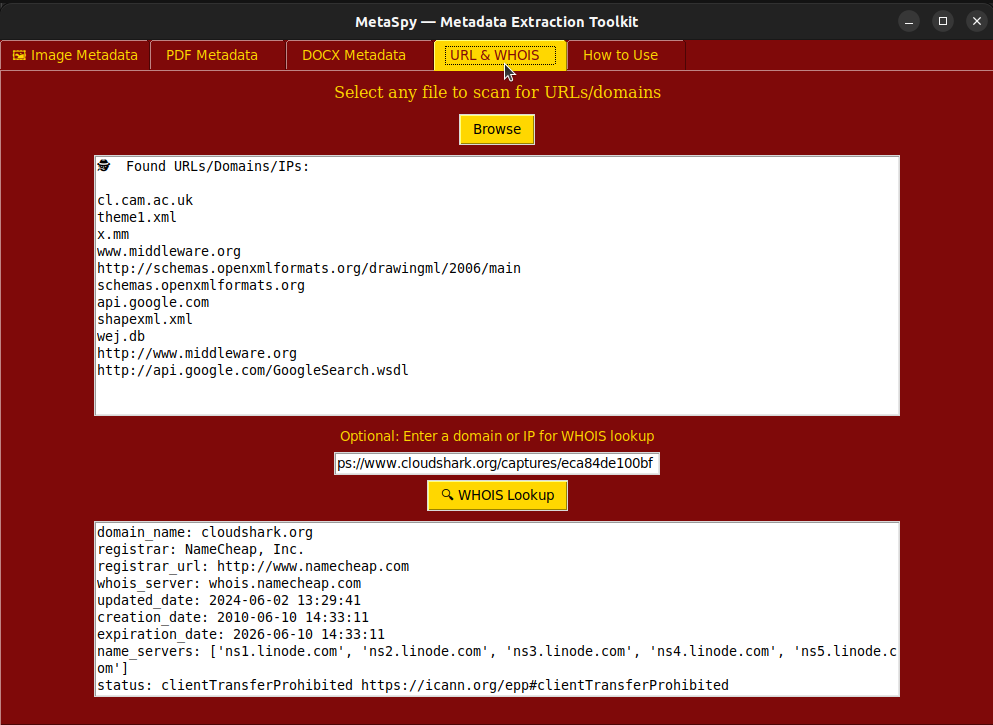
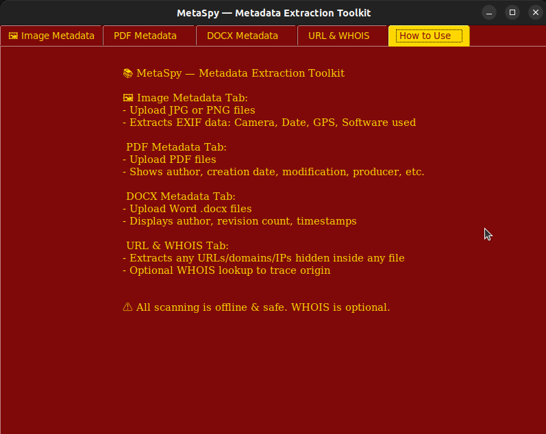

# 🕵️‍♂️ MetaSpy — Reveal Hidden Metadata Inside Files

**MetaSpy** is a GUI-based metadata analyzer tool that helps you uncover what lies beneath the surface of files — from photos to PDFs to Office documents.

Whether you're a cybersecurity enthusiast, digital forensics student, or a curious mind — MetaSpy lets you **see what most people miss**.

---

## 🚀 Features

| Feature                              | Description                                                                 |
| ------------------------------------ | --------------------------------------------------------------------------- |
| 🖼️ Image Metadata Extraction         | Extracts EXIF metadata (date, GPS, device info) from `.jpg`, `.png`, `.jpeg` |
| 📄 PDF Metadata Analysis             | Shows author, producer, encryption status, creation/modification timestamps |
| 📄 DOCX Metadata Insights            | Extracts creator info, word count, template, and more from `.docx` files     |
| 🧾 Unified GUI                       | Simple, colorful interface using Python `tkinter`                            |
| 🧠 Offline & Secure                  | Fully offline. No data leaves your device.                                  |
| 🎨 Gryffindor Color Theme            | Red & Gold UI inspired by defenders of Hogwarts 🔐                          |
| 📖 "How to Use" Tab                  | Instructions built right into the app                                        |

---

## 📸 Supported File Types

- `.jpg`, `.jpeg`, `.png` — Image metadata (EXIF)
- `.pdf` — PDF metadata (with [PyMuPDF](https://pymupdf.readthedocs.io/))
- `.docx` — Word file metadata (with `python-docx`)

---

## 📦 Installation

### ✅ Step 1: Clone or Download

```bash
git clone https://github.com/yourusername/MetaSpy.git
cd MetaSpy
```

## Install Requirements
```bash
pip install -r requirements.txt
```

## ⚠️ Disclaimer

MetaSpy is built for educational & forensic purposes. It does not alter files, only reveals embedded metadata. Always respect user privacy and data ethics.


## Screenshots

> 

> 
